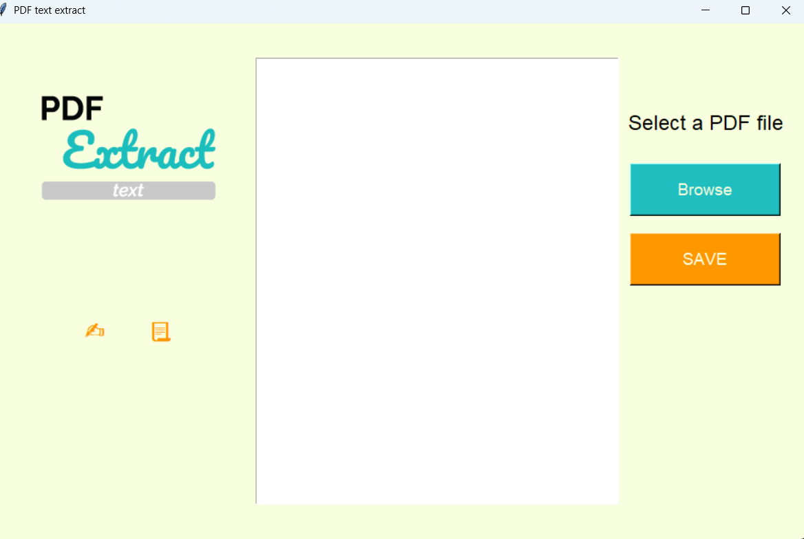
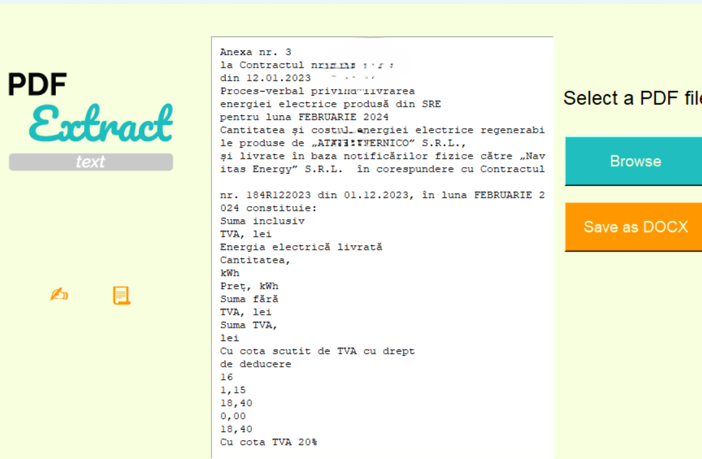
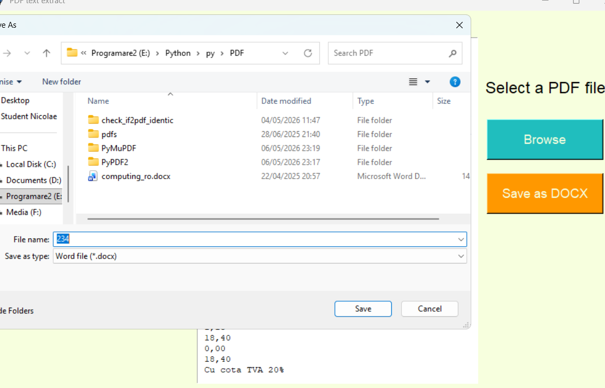

# 📄 PDF ↔ DOCX Converter (Tkinter GUI)

A desktop application built with Python that allows you to open, extract, and convert **PDF and DOCX files** using a simple graphical interface.

It uses **PyMuPDF** for accurate PDF parsing and **python-docx** for Word file processing.

---

## 🚀 Features

- 📥 Open PDF and DOCX files
- 🔍 Extract text from documents
- 📑 Preserve basic layout (using PyMuPDF blocks)
- 📊 Detect simple column structure
- 🖼️ Extract images from PDF
- 📤 Export:
  - PDF → DOCX
  - DOCX → PDF
- 🇷🇴 Supports Romanian diacritics (UTF-8 safe export)

---

## 🖼️ Screenshots

### Main Interface


### Open File Example


### Export Result


---

## ⚙️ Installation

### 1. Clone repository
```bash
git clone https://github.com/USERNAME/PDF_converter.git
cd PDF_converter


# PDF_converter

